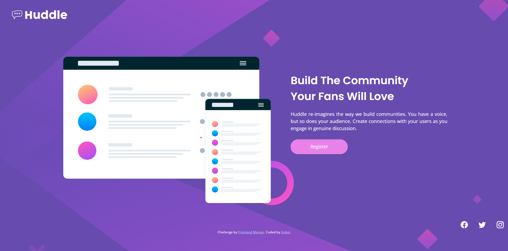

# Frontend Mentor - Huddle Landing Page with Single Introductory Section

This is a solution to the [Huddle landing page with a single introductory section challenge on Frontend Mentor](https://www.frontendmentor.io/challenges/huddle-landing-page-with-a-single-introductory-section-B_2Wvxgi0).

Frontend Mentor challenges help you improve your coding skills by building realistic projects.

---

## 🚀 Overview

### 🧩 The Challenge

Users should be able to:

- View the optimal layout for the page depending on their device's screen size
- See hover states for all interactive elements on the page

---

### 📸 Screenshot

  


---

### 🔗 Links

- 🔧 [Solution on Frontend Mentor](https://www.frontendmentor.io/solutions/your-solution-url)
- 🌐 [Live Site](https://your-live-site-url.com)

---

## 🛠️ My Process

### ✅ Built With

- Semantic HTML5
- CSS3 (custom properties)
- Flexbox
- Bootstrap 5 (CDN)
- Google Fonts (`Poppins`, `Open Sans`)
- Bootstrap Icons

---

### 🧠 What I Learned

- How to integrate Bootstrap for layout and responsiveness
- Customizing buttons and hover states using both Bootstrap and custom CSS
- Aligning content using Bootstrap's grid system
- Using `background-image` and `background-size` for full-page visuals
- How to import and apply Google Fonts properly via `@import`

#### Example Code Snippet
```html
div class="container ">
    <div class="row">
        <div class="col">
          
      </div>
      <div class="text col-5 ">
          <h3>Build The Community<br>Your Fans Will Love</h3>
          <p>Huddle re-imagines the way we build communities. You have a voice, but so does your audience. Create connections with your users as you engage in genuine discussion.</p>
          <button type="button" class="btn">Register</button>
      </div>
    </div>    
  </div>
```
```css

.btn {
    font-family: 'Open Sans', sans-serif;
    width: 12em;
    height: 50px;
    border-radius: 50px;
    background-color: white;
    color: hsl(257, 40%, 49%);
    border: none;
}

.btn:hover {
    background-color: hsl(300, 69%, 71%);
    color: white;
}
```

---

### 📈 Continued Development

In the future, I would like to:

- Add animation effects to icons and buttons
- Make the layout even more mobile-friendly with media queries
- Convert this into a React component for practice

---

### 📚 Useful Resources

- [Bootstrap Documentation](https://getbootstrap.com/docs/)
- [Google Fonts](https://fonts.google.com/)
- [MDN Web Docs](https://developer.mozilla.org/)

---

## 👤 Author

- GitHub – [@ctrlcoder-404](https://github.com/ctrlcoder-404)
- Frontend Mentor – [@ctrlcoder-404](https://www.frontendmentor.io/profile/ctrlcoder-404)

---

## 🙌 Acknowledgments

Thanks to [Frontend Mentor](https://www.frontendmentor.io) for the awesome challenge and community feedback system.
